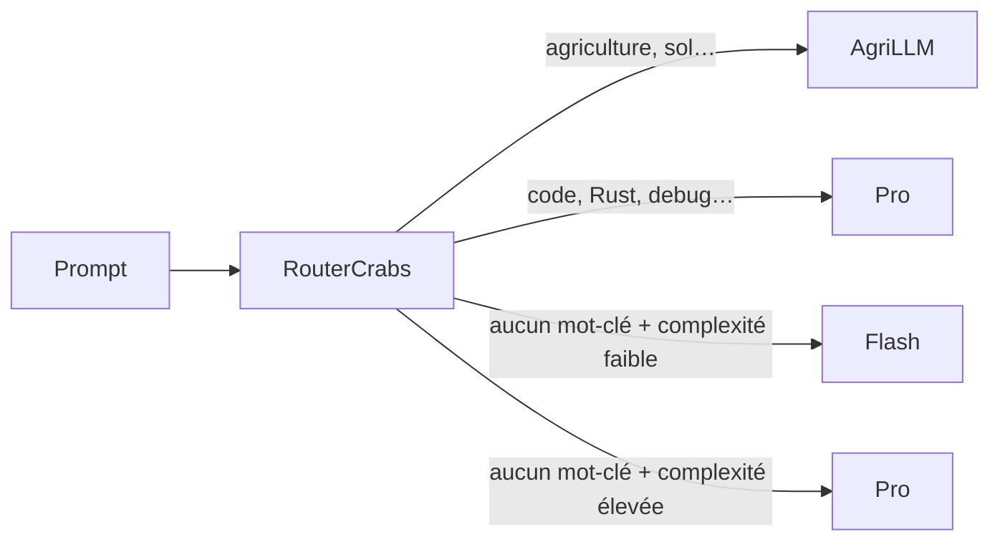

# RouterCrabs 🧭

Mini routeur OpenAI-compatible qui choisit automatiquement le bon modèle selon **le domaine** ou **la complexité** de ton prompt. Deux modes de routage, combinables :

- 🏷️ **Routage par domaine** — mots-clés → modèle spécialisé (agri → AgriLLM, code → Pro…)
- 🧠 **Routage par complexité** — heuristiques locales → Flash (simple) ou Pro (complexe)
- 🔌 **Multi-provider** — chaque tier peut pointer vers un fournisseur différent
- ⚡ **Zéro latence** — classification locale, substring match + heuristiques, <1ms
- 📦 **Un seul binaire** — ~4 Mo, pas de Docker, pas de base de données
- 🎯 **Streaming SSE** natif



---

## Démarrage rapide

```bash
git clone https://github.com/NadLad/RouterCrabs
cd RouterCrabs
cp tiers.yaml.example tiers.yaml
# Édite tiers.yaml → décommente la section [fallback] + tes domaines
cp .env.example .env
# Édite .env → mets tes clés API
cargo run --release
```

Puis dans OpenCrabs (`~/.opencrabs/config.toml`) :

```toml
[providers.custom.deepseek]
base_url = "http://localhost:8001/v1"
api_key = "not-needed"
default_model = "router-crabs"
```

---

## Comment ça marche

### 1. Routage par domaine (mots-clés)

Chaque tier définit une liste de mots-clés. RouterCrabs cherche ces mots-clés dans le prompt (substring, case-insensitive) et calcule un score :

```
Score = nombre de matchs × poids du tier
```

Le tier avec le meilleur score gagne. En cas d'égalité, le `weight` le plus élevé départage, puis `default: true`.

```
« Compare les rendements du blé et du maïs en agriculture biologique »
  → "agriculture" matché → tier agri → AgriLLM ✅
```

### 2. Routage par complexité (fallback)

Quand **aucun mot-clé de domaine** ne matche, RouterCrabs calcule un **score de complexité** (0–12) basé sur 5 heuristiques locales :

| Heuristique | Barème |
|---|---|
| **Longueur du prompt** | >2000 chars : +3<br>>800 chars : +2<br>>300 chars : +1 |
| **Présence de code** | ≥3 marqueurs (```, `fn`, `class`, `SELECT`…) : +3<br>≥1 : +2 |
| **Mots-clés techniques** | ≥4 : +3 (explique, architecture, algorithme, compare…)<br>≥2 : +2<br>≥1 : +1 |
| **Images** | +5 (toujours → Pro) |
| **Question ouverte** | `?` + pourquoi/comment/how/why : +1 |

Si le score ≥ `threshold` → modèle **complexe**. Sinon → modèle **simple**.

```
« Bonjour »            → score 0 < 3 → DeepSeek Flash ✅
« Explique l'archi     → score 5 ≥ 3 → DeepSeek Pro   ✅
  microservices, compare
  les tradeoffs de perf »
```

### 3. Algorithme complet (hybride)

```
1. Mots-clés de domaine → si match → tier spécialisé
2. Sinon → score de complexité → ≥ seuil → modèle complexe
                                 → < seuil → modèle simple
3. Sinon (pas de section fallback) → tier default: true
```

---

## Configuration — `tiers.yaml`

```yaml
port: 8001

# ── Tiers par domaine (mots-clés) ──────────────────────────
tiers:
  - model: "agrillm-v2"
    api_base: "https://api.agrillm.com/v1"
    api_key: "${AGRI_API_KEY}"
    keywords: [agriculture, agronomie, sol, plante, récolte, élevage]
    weight: 20

  - model: "deepseek-v4-pro"
    api_base: "https://api.deepseek.com"
    api_key: "${DEEPSEEK_API_KEY}"
    keywords: [code, Rust, Python, API, database, SQL, Docker, déploiement]
    weight: 10

# ── Routage par complexité (fallback) ──────────────────────
fallback:
  threshold: 3          # seuil de bascule simple → complexe
  simple:
    model: "deepseek-v4-flash"
    api_base: "https://api.deepseek.com"
    api_key: "${DEEPSEEK_API_KEY}"
  complex:
    model: "deepseek-v4-pro"
    api_base: "https://api.deepseek.com"
    api_key: "${DEEPSEEK_API_KEY}"
```

### Champs par tier

| Champ | Requis | Défaut | Description |
|---|---|---|---|
| `model` | ✅ | — | Modèle à appeler |
| `api_base` | ✅ | — | URL de base de l'API |
| `api_key` | ✅ | — | Clé (`${VAR}` = variable d'environnement) |
| `auth_header` | ❌ | `Bearer` | Header d'auth (`x-api-key` pour Anthropic natif) |
| `keywords` | ❌ | `[]` | Mots-clés (minuscules, substring match) |
| `weight` | ❌ | `1` | Priorité en cas d'égalité |
| `default` | ❌ | `false` | Fallback ultime si aucun mot-clé ni `fallback` |

### Champs de la section `fallback`

| Champ | Requis | Défaut | Description |
|---|---|---|---|
| `threshold` | ❌ | `3` | Score de complexité minimum pour basculer vers `complex` |
| `simple.model` | ✅ | — | Modèle pour les requêtes simples |
| `simple.api_base` | ✅ | — | URL de base |
| `simple.api_key` | ✅ | — | Clé API |
| `complex.model` | ✅ | — | Modèle pour les requêtes complexes |
| `complex.api_base` | ✅ | — | URL de base |
| `complex.api_key` | ✅ | — | Clé API |

---

## Debug

Chaque réponse inclut des headers pour tracer le routage :

```
X-RouterCrabs-Tier:   complex-fallback
X-RouterCrabs-Model:  deepseek-v4-pro
X-RouterCrabs-Reason: complexité élevée (score: 5, seuil: 3)
```

Pour voir les scores en détail :

```bash
RUST_LOG=debug cargo run --release
```

---

## Variables d'environnement

| Variable | Défaut | Description |
|---|---|---|
| `TIERS_CONFIG` | `tiers.yaml` | Chemin vers la config YAML |
| `PORT` | `8001` | Port d'écoute |
| `RUST_LOG` | `info,router_crabs=debug` | Niveau de log |
| `*_API_KEY` | — | Clés API (référencées dans `tiers.yaml` via `${VAR}`) |

---

## Utilisation comme librairie Rust

```rust
use router_crabs::{TiersConfig, Message, select_tier, score_complexity, forward_request};

let config = TiersConfig::load("tiers.yaml")?;
let (tier, reason) = select_tier(&config, &messages);
let complexity = score_complexity(&messages);
```

---

## Licence

MIT
