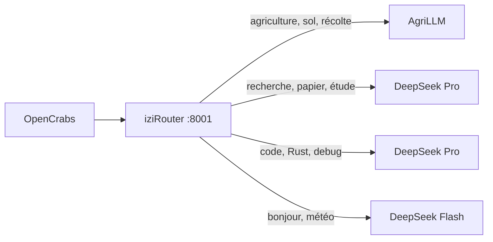

# iziRouter 🧭

Mini routeur OpenAI-compatible qui choisit automatiquement le bon modèle selon **le domaine détecté** dans ton prompt.

- 🏷️ **Routage par mots-clés** — définis N tiers, chaque tier a ses mots-clés
- 🔌 **Multi-provider** — chaque tier peut pointer vers un fournisseur différent (DeepSeek, OpenAI, Groq, Anthropic, OpenRouter, AgriLLM...)
- ⚡ **Zéro latence** — classification locale, substring match, <1ms
- 📦 **Un seul binaire** — ~4 Mo, pas de Docker, pas de base de données
- 🎯 **Streaming SSE** natif



---

## Démarrage rapide

```bash
# 1. Cloner
git clone https://github.com/NadLad/iziRouter
cd iziRouter

# 2. Configurer les tiers
cp tiers.yaml.example tiers.yaml
# Édite tiers.yaml → adapte les modèles et mots-clés

# 3. Clés API
cp .env.example .env
# Édite .env → mets tes clés API

# 4. Lancer
cargo run --release
```

Ensuite dans OpenCrabs (`~/.opencrabs/config.toml`) :

```toml
[providers.custom.deepseek]
base_url = "http://localhost:8001/v1"
api_key = "not-needed"
default_model = "izi-router"
```

---

## Configuration — `tiers.yaml`

```yaml
port: 8001

tiers:
  - model: "agrillm-v2"
    api_base: "https://api.agrillm.com/v1"
    api_key: "${AGRI_API_KEY}"          # interpolé depuis .env
    keywords:                           # mots-clés pour ce tier
      - agriculture
      - agronomie
      - sol
      - récolte
    weight: 10                          # priorité (défaut: 1)

  - model: "deepseek-v4-flash"
    api_base: "https://api.deepseek.com/v1"
    api_key: "${DEEPSEEK_API_KEY}"
    keywords: []                        # vide + default → fallback
    default: true
```

### Champs par tier

| Champ | Requis | Défaut | Description |
|-------|--------|--------|-------------|
| `model` | ✅ | — | Nom du modèle à appeler |
| `api_base` | ✅ | — | URL de base de l'API |
| `api_key` | ✅ | — | Clé API (`${VAR}` = variable d'environnement) |
| `auth_header` | ❌ | `Bearer` | Header d'auth (`x-api-key` pour Anthropic natif) |
| `keywords` | ❌ | `[]` | Mots-clés déclencheurs (minuscules, substring match) |
| `weight` | ❌ | `1` | Poids en cas d'égalité (plus élevé = prioritaire) |
| `default` | ❌ | `false` | Tier fallback si aucun mot-clé ne matche |

---

## Algorithme de routage

Pour chaque requête entrante :

1. Le texte complet de tous les messages est concaténé et mis en minuscules
2. Pour chaque tier avec des mots-clés, on compte combien de mots-clés apparaissent dans le texte
3. **Score = nombre de matchs × poids du tier**
4. Le tier avec le **score le plus élevé** est sélectionné
5. En cas d'égalité : poids le plus élevé → `default: true`
6. Si **aucun mot-clé** ne matche → tier avec `default: true`

### Exemple

```
Prompt : « Compare les rendements du blé et du maïs en agriculture biologique »
→ "agriculture" matché dans tier "agri" → score = 1 × 10 = 10
→ Aucun autre tier ne matche
→ Routage vers AgriLLM ✅
```

```
Prompt : « Écris une fonction Rust qui trie un vecteur »
→ "Rust" matché dans tier "code" → score = 1 × 5 = 5
→ Routage vers DeepSeek Pro ✅
```

```
Prompt : « Bonjour, comment ça va ? »
→ Aucun mot-clé matché
→ Routage vers le tier default (DeepSeek Flash) ✅
```

---

## Debug

Chaque réponse inclut des headers pour tracer le routage :

```
X-iziRouter-Tier:   agri
X-iziRouter-Model:  agrillm-v2
X-iziRouter-Reason: agri (matches: [agriculture, biologique], score: 20)
```

Pour voir les scores en détail :

```bash
RUST_LOG=debug cargo run --release
```

---

## Variables d'environnement

| Variable | Défaut | Description |
|----------|--------|-------------|
| `TIERS_CONFIG` | `tiers.yaml` | Chemin vers le fichier de config YAML |
| `PORT` | `8001` | Port d'écoute |
| `RUST_LOG` | `info,izi_router=debug` | Niveau de log |
| `*_API_KEY` | — | Clés API (référencées dans `tiers.yaml` via `${VAR}`) |

---

## Licence

MIT
