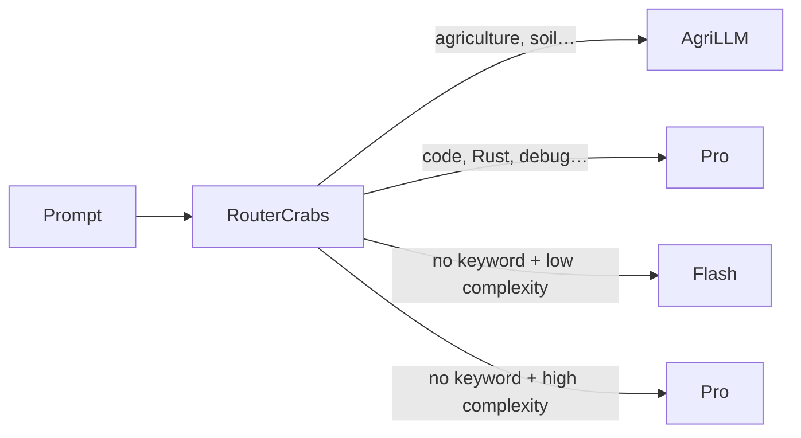

# RouterCrabs 🧭

A lightweight OpenAI-compatible proxy that automatically picks the right model based on **domain** or **complexity** of your prompt. Two routing modes, combinable:

- 🏷️ **Domain routing** — keywords → specialized model (agri → AgriLLM, code → Pro…)
- 🧠 **Complexity routing** — local heuristics → Flash (simple) or Pro (complex)
- 🔌 **Multi-provider** — each tier can point to a different provider
- ⚡ **Zero latency** — local classification, substring match + heuristics, <1ms
- 📦 **Single binary** — ~4 MB, no Docker, no database
- 🎯 **Native SSE streaming**


```mermaid
flowchart LR
    A[Prompt] --> B[RouterCrabs]
    B -->|"agriculture, soil…"| C[AgriLLM]
    B -->|"code, Rust, debug…"| D[Pro]
    B -->|"no keyword + low complexity"| E[Flash]
    B -->|"no keyword + high complexity"| F[Pro]
```

---

## Quick Start

```bash
git clone https://github.com/NadLad/RouterCrabs
cd RouterCrabs
cp tiers.yaml.example tiers.yaml
# Edit tiers.yaml → uncomment the [fallback] section + your domains
cp .env.example .env
# Edit .env → add your API keys
cargo run --release
```

Then in OpenCrabs (`~/.opencrabs/config.toml`):

```toml
[providers.custom.deepseek]
base_url = "http://localhost:8001/v1"
api_key = "not-needed"
default_model = "router-crabs"
```

---

## How It Works

### 1. Domain Routing (keywords)

Each tier defines a list of keywords. RouterCrabs scans the prompt for these keywords (substring, case-insensitive) and computes a score:

```
Score = match_count × tier_weight
```

The tier with the highest score wins. Ties are broken by `weight`, then `default: true`.

```
"Compare wheat and corn yields in organic agriculture"
  → "agriculture" matched → agri tier → AgriLLM ✅
```

### 2. Complexity Routing (fallback)

When **no domain keywords** match, RouterCrabs computes a **complexity score** — a *signed* integer that can go negative — as the sum of objective heuristics plus **per-keyword signed weights**:

| Component | Scoring |
|---|---|
| **Prompt length** | >2000 chars: +3<br>>800 chars: +2<br>>300 chars: +1 |
| **Code presence** | ≥3 markers (```, `fn`, `class`, `SELECT`…): +3<br>≥1: +2 |
| **Images** | +5 (always → Pro) |
| **Technical keywords** | +1 each (explain, architecture, algorithm, compare…) |
| **Simple keywords** | **−3 each** (salut, hello, thanks, merci…) — counterweight |
| **Question words** | 0 (neutral markers — pourquoi, why, comment…) |

If score ≥ `threshold` → **complex** model. Otherwise → **simple** model. A negative score (several simple words) reliably stays on the simple model.

```
"salut merci"          → score −6 < 3 → DeepSeek Flash ✅
"Hello"                → score −3 < 3 → DeepSeek Flash ✅
"Explain microservices → score 5 ≥ 3 → DeepSeek Pro   ✅
 architecture, compare
 performance tradeoffs"
```

#### Customizing Keywords — `keywords.yaml`

The technical keywords, **simple keywords**, question words, and code markers used for scoring are loaded from a separate YAML file. This file is **trilingual** by default (French, English, Arabic) and organized by language for easy maintenance. Each list carries a signed weight: technical `+1`, simple `−3`, question `0`.

```yaml
# keywords.yaml — v0.3+ language-based format

code_markers:
  - "```"
  - "fn "
  - "class "
  - "SELECT "
  # ...

languages:
  french:
    technical_keywords:
      - "explique"
      - "algorithme"
      - "sécurité"
      # ...
    question_words:
      - "pourquoi"
      - "comment"
      # ...

  english:
    technical_keywords:
      - "explain"
      - "algorithm"
      - "security"
      # ...
    question_words:
      - "why"
      - "how"
      # ...

  arabic:
    technical_keywords:
      - "اشرح"
      - "خوارزمية"
      - "أمان"
      # ...
    question_words:
      - "لماذا"
      - "كيف"
      # ...
```

All languages are merged into one pool at runtime — add as many as you need. If the file is missing or a section is empty, built-in defaults are used. Edit and restart the service — no recompilation needed.

##### Adding a New Language

To add Spanish, German, Italian, or any other language, copy one of the existing language blocks and translate the keywords:

```yaml
languages:
  # ... existing french, english, arabic ...

  spanish:
    technical_keywords:
      - "explica"
      - "analiza"
      - "compara"
      - "arquitectura"
      - "algoritmo"
      - "optimiza"
      - "seguridad"
      - "implementa"
      - "configura"
      - "despliega"
      - "compila"
      - "concurrente"
      - "memoria"
      - "cache"
      - "latencia"
      - "escalabilidad"
      - "contenedor"
      - "prueba unitaria"
      - "cifra"
      - "protocolo"
      # ... add more as needed
    question_words:
      - "por qué"
      - "cómo"
      - "qué es"
      - "puedes"
      - "qué"
      - "quién"
      - "dónde"
      - "cuándo"
      - "cuál"
```

That's it. Restart RouterCrabs and your new language is active — a `"¿cómo implementar un middleware?"` will now go to Pro, while `"¿cómo estás?"` stays on Flash.

> **Tip:** A commented Spanish template is already included at the bottom of `keywords.yaml`. Uncomment and customize.

### 3. Full Algorithm (hybrid)

```
1. Domain keywords → if match → specialized tier
2. Otherwise → complexity score → ≥ threshold → complex model
                                 → < threshold → simple model
3. Otherwise (no fallback section) → tier with default: true
```

---

## Configuration — `tiers.yaml`

```yaml
port: 8001
# host: "0.0.0.0"       # uncomment to bind to LAN
# keywords_path: "keywords.yaml"  # custom scoring keyword file

# ── Domain tiers (keywords) ──────────────────────────────
tiers:
  - model: "agrillm-v2"
    api_base: "https://api.agrillm.com/v1"
    api_key: "${AGRI_API_KEY}"
    keywords: [agriculture, agronomy, soil, plant, harvest, livestock]
    weight: 20

  - model: "deepseek-v4-pro"
    api_base: "https://api.deepseek.com"
    api_key: "${DEEPSEEK_API_KEY}"
    keywords: [code, Rust, Python, API, database, SQL, Docker, deployment]
    weight: 10

# ── Complexity routing (fallback) ──────────────────────
fallback:
  threshold: 3          # switch threshold: simple → complex
  simple:
    model: "deepseek-v4-flash"
    api_base: "https://api.deepseek.com"
    api_key: "${DEEPSEEK_API_KEY}"
  complex:
    model: "deepseek-v4-pro"
    api_base: "https://api.deepseek.com"
    api_key: "${DEEPSEEK_API_KEY}"
```

### Global Fields

| Field | Required | Default | Description |
|---|---|---|---|
| `port` | ❌ | `8001` | Listening port |
| `host` | ❌ | `127.0.0.1` | Bind address (`0.0.0.0` = LAN) |
| `keywords_path` | ❌ | `keywords.yaml` | Path to scoring keywords file |
| `journal_path` | ❌ | `journal.jsonl` | Path to the append-only request journal |

### Tier Fields

| Field | Required | Default | Description |
|---|---|---|---|
| `model` | ✅ | — | Model to call |
| `api_base` | ✅ | — | API base URL |
| `api_key` | ✅ | — | Key (`${VAR}` = environment variable) |
| `auth_header` | ❌ | `Bearer` | Auth header (`x-api-key` for native Anthropic) |
| `keywords` | ❌ | `[]` | Keywords (lowercase, substring match) |
| `weight` | ❌ | `1` | Priority in case of a tie |
| `default` | ❌ | `false` | Ultimate fallback if no keywords nor `fallback` |

### Fallback Section Fields

| Field | Required | Default | Description |
|---|---|---|---|
| `threshold` | ❌ | `3` | Minimum complexity score to switch to `complex` |
| `simple.model` | ✅ | — | Model for simple requests |
| `simple.api_base` | ✅ | — | Base URL |
| `simple.api_key` | ✅ | — | API key |
| `complex.model` | ✅ | — | Model for complex requests |
| `complex.api_base` | ✅ | — | Base URL |
| `complex.api_key` | ✅ | — | API key |

---

## Request Journal & Feedback

Every request is appended to an **append-only JSONL journal** (`journal.jsonl`,
chmod 600) — one JSON object per line. This is the raw material that makes
later learning possible (feedback → analysis → keyword updates).

**`req` line** — written on every request:
```json
{"type":"req","id":"ab3b89c6-…","ts":"2026-08-27T21:16:20Z","profile":"unknown","prompt":"explique l'architecture des microservices","prompt_truncated":false,"score":3,"matched":["explique","architecture","microservice"],"weights":[["explique",1],["architecture",1],["microservice",1]],"routed":"pro","reason":"complexity: high (score: 3, threshold: 3)"}
```

| Field | Type | Description |
|---|---|---|
| `type` | string | `"req"` or `"fb"` |
| `id` | uuid | Unique request id (only on `req`) |
| `ts` | string | ISO 8601 UTC timestamp |
| `profile` | string | Emitting profile, from the `X-RouterCrabs-Profile` header (default `unknown`) |
| `prompt` | string | Last user message, truncated to 2000 chars |
| `prompt_truncated` | bool | `true` if the prompt was truncated |
| `score` | int | Complexity score — a **signed** integer (can be negative) |
| `matched` | array | Technical keywords that matched |
| `weights` | array | Matched keywords with their signed weight (`[term, weight]` pairs) |
| `routed` | string | `"pro"`, `"flash"`, or the domain tier name |
| `reason` | string | Human-readable routing reason |

**`fb` line** — written when explicit feedback arrives via
`POST /v1/feedback`:
```json
{"type":"fb","req_id":"ab3b89c6-…","ts":"2026-08-27T21:16:39Z","correct_tier":"flash","source":"slash"}
```

Feedback endpoint:
```bash
# "The last request should have gone to Flash" (it went to Pro)
curl -s -X POST http://localhost:8001/v1/feedback \
  -H "Content-Type: application/json" \
  -d '{"correction":"flash"}'

# "The last request should have gone to Pro" (it went to Flash)
curl -s -X POST http://localhost:8001/v1/feedback \
  -H "Content-Type: application/json" \
  -d '{"correction":"pro"}'
```

`correction` accepts `"pro"` or `"flash"` (or `correct_tier` as an alias);
anything else returns HTTP 400. `source` defaults to `"slash"` (explicit
`/pro` and `/flash` commands) — pass `"agent"` for agent self-assessment.

---

## Self-Improvement Loop — `analyze` / `apply`

RouterCrabs ships a two-command loop that turns the journal + feedback into
**proposed** keyword edits — but **never applies anything automatically**.
The workflow is strictly: observe → propose → human approve → apply.

### `router-crabs analyze`

Scans the journal, joins each `fb` line to its originating `req`, aggregates
feedback per term, and writes **edit proposals** as YAML files in
`<config-dir>/proposals/`. It only *reads* the config — it never modifies it.
The config is resolved from `$HOME/.config/routercrabs/tiers.yaml` when
`TIERS_CONFIG` is unset, so the CLI works from any working directory.

```bash
router-crabs analyze
# Propositions : 0
# Répertoire : ~/.config/routercrabs/proposals/
```

A proposal looks like:

```yaml
id: 20260827T213000Z-a1b2c3d4
created_at: 2026-08-27T21:30:00Z
type: add            # add | adjust | remove
target: technical_keywords   # technical_keywords | simple_keywords | question_words
language: french     # french | english | arabic
term: refactoriser
weight: 1
reason: "4 corrections vers flash sur 6 requêtes"
evidence:
  req_ids: ["…", "…", "…"]
  correct_tier_ratio: 0.67
```

Proposals are only generated once a term crosses a threshold (by default
5 promotions for `add`, 3 corrections for `adjust`/`remove`). With a small
journal the output is honestly **0 propositions** — the thresholds are a
deliberate anti-runaway guard.

### `router-crabs apply <proposal.yaml>`

Applies an **already-approved** proposal to `keywords.yaml`, with guards:

1. Backs up `keywords.yaml` to a timestamped `.bak` file (`cp -a`).
2. Applies the edit (add / adjust weight / remove term).
3. Re-validates the resulting YAML — on parse failure it **aborts** and
   leaves the backup untouched.
4. Restarts the service via `systemctl --user restart routercrabs.service`.

```bash
router-crabs apply ~/.config/routercrabs/proposals/20260827T213000Z-a1b2c3d4.yaml
```

Because `apply` edits a real config file, only run it on a proposal a human
has explicitly approved.

---

## Debug

Every response includes headers to trace routing:

```
X-RouterCrabs-Tier:   complex-fallback
X-RouterCrabs-Model:  deepseek-v4-pro
X-RouterCrabs-Reason: complexity: high (score: 5, threshold: 3)
```

To see detailed scores:

```bash
RUST_LOG=debug cargo run --release
```

---

## Environment Variables

| Variable | Default | Description |
|---|---|---|
| `TIERS_CONFIG` | `~/.config/routercrabs/tiers.yaml` | Path to the YAML config (when unset, the CLI and the server fall back to the real config location — `tiers.yaml` relative only if `HOME` is empty) |
| `PORT` | `8001` | Listening port |
| `RUST_LOG` | `info,router_crabs=debug` | Log level |
| `*_API_KEY` | — | API keys (referenced in `tiers.yaml` via `${VAR}`) |

---

## Usage as a Rust Library

```rust
use router_crabs::{TiersConfig, Message, ScoringKeywords, select_tier, score_complexity, forward_request};

let config = TiersConfig::load("tiers.yaml")?;
let (tier, reason) = select_tier(&config, &messages);
let complexity = score_complexity(&messages, &config.keywords);
```

---

## License

MIT
